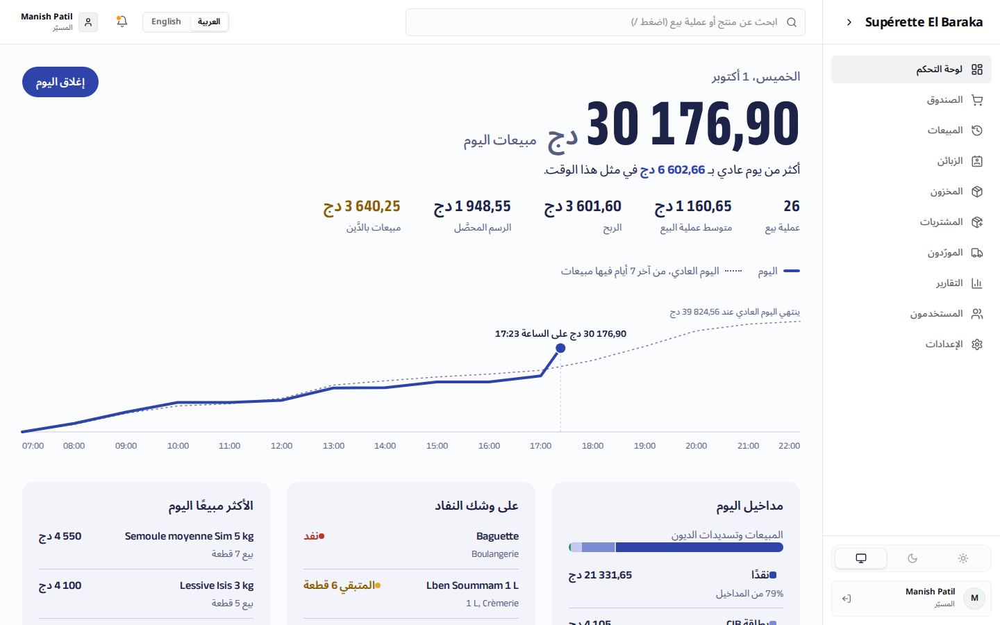
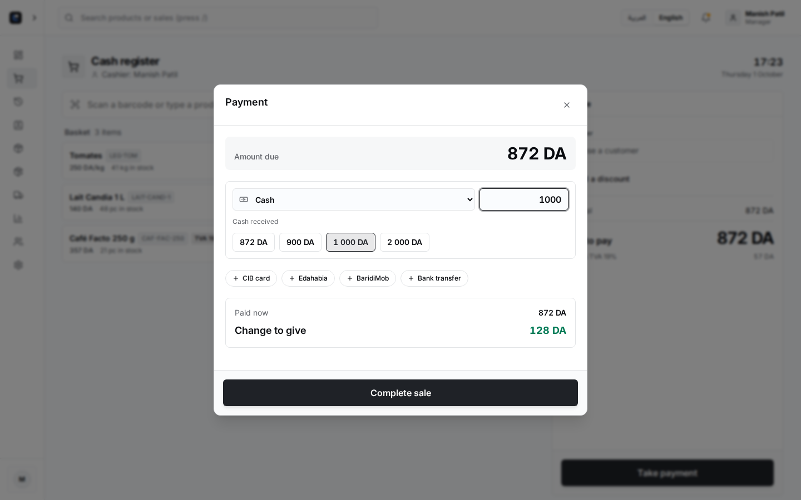

<div align="center">
  
</div>

# LoomPOS

### Point of sale and stock management for Algerian shops

LoomPOS is a single-store point of sale for groceries, supérettes and retail shops in Algeria. It works in Algerian dinars (DZD), speaks Arabic (right to left) and English, takes the payment methods Algerian customers actually use, sells by the piece or by weight, keeps customer credit (الكريدي) and supplier balances, and prints receipts for 58 mm and 80 mm thermal printers.

---

## Screenshots

| Dashboard (العربية) | Cash register (English) |
| :---: | :---: |
|  |  |

---

## Features

* **Algerian dinar throughout**: prices, costs, discounts, TVA, profit, refunds, credit and reports in DZD, formatted the Algerian way (`1 250,50 DA` / `1 250,50 دج`). The server recomputes every sale, so totals never come from the browser.
* **Tax-included prices (TTC)**: shelf prices include TVA, as in Algerian retail. Rates of 0% (exempt goods, IFU flat-tax shops), 9% and 19%. Receipts show the TVA contained in the total.
* **Algerian payment methods**: cash (espèces) with change, CIB and Edahabia cards on the terminal, BaridiMob, bank transfer (virement) and credit (à crédit). One sale can be split across several methods.
* **Customer credit**: put all or part of a sale on a customer's account, with an optional credit limit. Repayments settle the oldest unpaid sales first.
* **Refunds**: refund part or all of a sale, put items back in stock or not, and cancel unpaid credit before handing money back.
* **Units and weights**: piece, kg, g, L, mL and box. Weighed goods take decimal quantities: 1,5 kg × 250 DA/kg = 375 DA.
* **Expiry dates** (تاريخ نهاية الصلاحية): give any product an optional expiry date. Inventory marks expired products in red and those expiring within 14 days in amber, can list only those, and the notifications panel and the till warn about them. A product is still good on its expiry day.
* **Suppliers and purchases**: record deliveries, update stock and cost prices, and track what the shop owes each supplier.
* **Reports**: daily or monthly sales, refunds, TVA, cost, profit, money in by payment method, expected cash, and CSV export.
* **Arabic and English**: every screen, receipt, error and message is translated. Arabic switches the whole layout to right to left.
* **Receipts**: thermal tickets (58 or 80 mm) and A4 invoices with the shop's NIF, RC, NIS and AI numbers.
* **Roles**: managers see everything; cashiers use the till, sales, customers and inventory, and need the manager's password to change products.
* **Barcode labels**: print shelf and product labels on label rolls or A4 sheets.

---

## Tech stack

* **Frontend**: React 18, TypeScript, Tailwind CSS 4, Zustand, Vite, bundled Inter and Noto Sans Arabic fonts (works offline).
* **Backend**: Node.js, Express, Prisma, PostgreSQL, Zod validation, JWT and bcrypt.
* **Tests**: Vitest for the money, tax, units, payment and refund rules.

---

## Architecture

* `src/lib/domain/` holds the business rules shared by the browser and the server: dinar formatting and rounding, units, TVA, payment methods, sale pricing, payment settlement, refunds and Algerian phone numbers. The till previews totals with these functions; the server recomputes them before saving.
* `src/i18n/` is the translation system. Each feature keeps its English and Arabic text side by side in `src/i18n/messages/<feature>.ts`. TypeScript refuses to compile if the Arabic keys differ from the English ones. `useI18n()` gives components `t()`, Arabic plural rules, and formatters for money, quantities, dates, times and phone numbers.
* `server/` is the Express API: `index.ts` (auth, staff, products, settings) and `routes/` for sales and refunds, customers, suppliers and purchases, and reports.
* All checkout, refund, repayment and purchase operations run in database transactions.

### Adding a payment method

Add one entry to `PAYMENT_METHODS` in `src/lib/domain/payments.ts`, then its label and hint under `payments.methods` and `payments.hints` in `src/i18n/messages/common.ts` (both languages). The till, filters, reports and receipts pick it up automatically.

### Adding a language

Add the language code to `Lang` in `src/i18n/define.ts` and to `LANGUAGES` in `src/i18n/index.tsx`, then add its text to every file in `src/i18n/messages/`.

---

## Project structure

```
loom-pos/
├── prisma/                 # Schema and migrations
├── scripts/seed.ts         # Creates the first accounts and empty store settings
├── server/
│   ├── index.ts            # Auth, staff, products, settings
│   ├── context.ts          # Prisma, auth guards, translated error codes
│   └── routes/             # sales, customers, suppliers, reports
├── src/
│   ├── components/         # billing, orders, customers, inventory, suppliers, reports, settings, dashboard, layout
│   ├── i18n/               # Translation system and messages (ar, en)
│   ├── lib/domain/         # Shared business rules, with tests
│   ├── lib/api.ts          # API client with translated errors
│   └── store/useStore.ts   # Global state, persisted language and cart
└── vite.config.ts
```

---

## Installation

```bash
npm install
cp .env.example .env          # then set DATABASE_URL and JWT_SECRET
npx prisma migrate deploy
npm run seed                  # creates admin/admin123 and cashier/cashier123
```

The seed adds no products or sales. Enter your catalogue under **Inventory**, or record a delivery under **Purchases**.

### Upgrading an existing database

The `algeria_localization` migration keeps existing data: old card and UPI sales become CIB and BaridiMob, old tax-exclusive line prices are restated tax included, and each old sale gets a payment record. Product prices are not converted between currencies: check them after upgrading.

---

## Running locally

```bash
npm run dev:api                 # API on http://localhost:3001, restarts on changes
npm run dev                     # app on http://localhost:5173
npm test                        # business rule tests
npm run lint && npm run typecheck
```

---

## Environment variables

| Variable | Description |
| :--- | :--- |
| `DATABASE_URL` | PostgreSQL connection string |
| `JWT_SECRET` | Secret that signs login sessions. **Required in production** (at least 16 random characters, e.g. `openssl rand -hex 32`); the server refuses to start without it. In development a random one is used per run. |
| `PORT` | API port (default 3001) |
| `TZ` | Time zone for "today", days and hours in reports (default `Africa/Algiers`, whatever the host's clock) |
| `TRUST_PROXY` | Set to `1` behind a reverse proxy (Render, Nginx) so login rate limits see each caller's real address |
| `CORS_ORIGIN` | Comma-separated web addresses allowed to call the API. Unset: any |

---

## API overview

| Method | Endpoint | Description | Auth |
| :--- | :--- | :--- | :--- |
| `POST` | `/api/auth/login` | Log in, returns a JWT (rate limited) | None |
| `GET` | `/api/products` | Search the catalogue; `expiring=1` lists expired or soon-to-expire products | Staff |
| `POST/PUT/DELETE` | `/api/products[/:id]` | Manage products | Manager, or cashier with a manager's password |
| `GET` | `/api/inventory/low-stock` | Products below their unit's threshold | Staff |
| `GET` | `/api/inventory/expiring` | In-stock products expired or expiring within 14 days | Staff |
| `POST` | `/api/orders` | Create a sale with split payments, change and credit | Staff |
| `GET` | `/api/orders[/:id]` | Sales history and details | Staff |
| `POST` | `/api/orders/:id/refunds` | Refund items from a sale | Staff |
| `GET/POST/PUT` | `/api/customers[/:id]` | Customers and their accounts | Staff |
| `POST` | `/api/customers/:id/payments` | Record a credit repayment | Staff |
| `GET/POST/PUT` | `/api/suppliers[/:id]` | Suppliers and balances | Manager |
| `POST` | `/api/suppliers/:id/payments` | Pay a supplier | Manager |
| `GET/POST` | `/api/purchases` | Record goods received | Manager |
| `GET` | `/api/reports?from&to&groupBy` | Daily or monthly report | Manager |
| `GET` | `/api/analytics/summary`, `/today` | Today so far, for the dashboard | Manager |
| `GET/PUT` | `/api/settings` | Shop, language, payments and receipts | GET before login: name and address only. PUT: Manager |

Errors return a stable `code` (for example `INSUFFICIENT_STOCK` or `CREDIT_LIMIT_EXCEEDED`) that the app translates.

### Safe retries

Sales, refunds, repayments, purchases and supplier payments accept a `requestId` (8–64 letters, digits, `-` or `_`). Sending the same request again with the same id, for example after a lost connection, returns the first result with status 200 instead of recording it twice. The app does this automatically.

### Concurrency

Writes lock the rows they change (customer or supplier, then the sale or purchase, then products) and take document numbers one at a time, so several tills can sell the last units of a product, refund the same sale or record repayments at the same moment without overselling, double refunds or lost balance updates. The database also refuses negative stock.

---

## Deployment

```bash
npm run build                                     # static app in dist/
NODE_ENV=production pm2 start npm --name loompos-api -- run start:api
```

---

## Security

* Passwords are hashed with bcrypt; the shared cashier password is never sent to browsers.
* Sessions use JWTs that expire after 12 hours. The session lives in memory: reloading the page asks for the password again (the cart is kept).
* Every endpoint except login and the shop name requires a signed-in user; suppliers, purchases, reports, staff and settings require a manager.
* Wrong passwords are rate limited (10 per account and address, 30 per account, per 15 minutes) on login, password change, password reset and the manager password a cashier types.
* The default `admin`/`admin123` account is created only on an empty database. The server logs a warning while any manager still uses it: change it after the first login.
* The last active manager cannot be deactivated or demoted.

---

## License

MIT. See [LICENSE](LICENSE).
